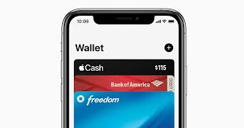

# Apple Pay

## The Future of Digital Wallet Services

Apple Pay is arguably the leading mobile payment and digital wallet service. It allows users to makepayments in person, in iOS apps, and on the web. It is supported on the iPhone, Apple Watch, iPad, and Mac.

Contributers: Devin Nigro, Kevin Qiu, Jaime Bunay

### Apple Pay's Significance
Apple Pay is an innovative step into the fintech space on Apple's part. Cunsomers are always looking for more streamlined ways to pay for products. In an economy in which cash is increasingly less relevant and demand for more efficient and secure digital payment services is growing at an exponential rate, Apple Pay is in a unique position to become a leader as a digital wallet platform.